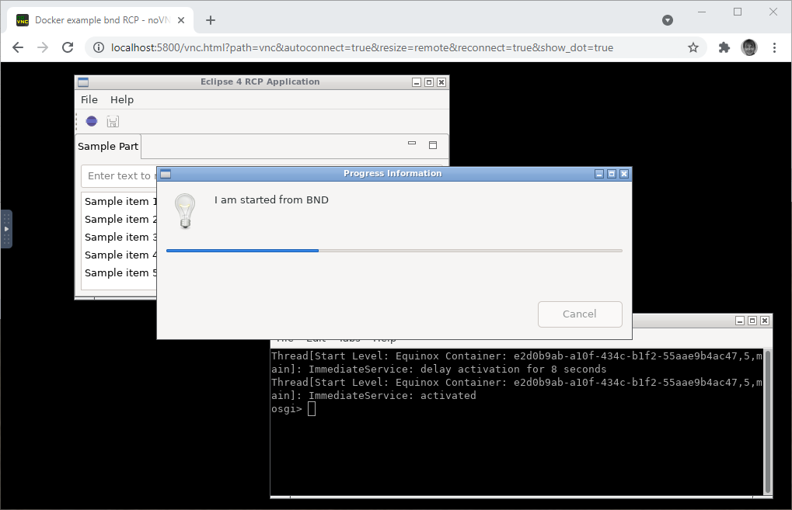
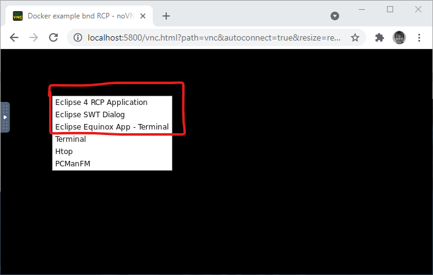

# Project description

[](https://github.com/klibio/example.bnd.rcp/actions/workflows/actions_build.yml)
[](https://hub.docker.com/repository/docker/klibio/example.bnd.rcp)
[](https://github.com/klibio/example.bnd.rcp/wiki)

# Overview

This projects exemplifies the development of [Eclipse 4 RCP Application](https://www.eclipse.org/equinox/) with [bndtools](https://bndtools.org/).
It enables
* local development with Eclipse IDE and bndtools
* continuous building and ProofOfPerformance (pop) with GitHub actions
* running inside Debian based Docker container with web browser accessible UI

Multiple minimalistic Eclipse RCP project types are demonstrated
1. headless application - targeted for terminal usage
2. [Eclipse SWT](https://www.eclipse.org/swt/) dialog UI 
3. Eclipse 4 RCP Product with SWT UI application 

See the project [](https://github.com/klibio/example.bnd.rcp/wiki) for more information on using, building and more!



# Local Development

**Prerequisites:**

| Tool | Version | Notes |
|------|---------|-------|
| Java JDK | 21 | Any distribution, e.g. [Eclipse Temurin](https://adoptium.net/). Must be on `PATH` or `JAVA_HOME` set. |
| Gradle | wrapper | `./gradlew` / `gradlew.bat` included — no separate install required. |
| bnd CLI | 7.3.0 | `biz.aQute.bnd-7.3.0.jar` is **committed to the workspace root** — no download needed. If you need to refresh it, download from [Maven Central](https://search.maven.org/artifact/biz.aQute.bnd/biz.aQute.bnd/7.3.0/jar) or [GitHub Releases](https://github.com/bndtools/bnd/releases/tag/7.3.0). |
| Graphical display | — | Required for the SWTBot test suite (Windows desktop or X11 on Linux). |

## Build

```bash
# Build all bundles
./gradlew build

# Export platform-specific products
./gradlew export.app.ui_linux.gtk.x86-64
./gradlew export.app.ui_win32.win32.x86-64
./gradlew export.app.ui_macosx.cocoa.x86-64
./gradlew export.app.ui_macosx.cocoa.aarch64

# Export all three application types for Linux (used by CI/Docker)
./gradlew export.app.ui_linux.gtk.x86-64 \
          export.12_equinoxapp_linux.gtk.x86-64 \
          export.ui_linux.gtk.x86-64
```

## Run exported artifacts

After the export Gradle task completes, launch the product directly:

```bash
# Linux — Eclipse 4 RCP product
./example.rcp.app.ui/_export/linux.gtk.x86-64/eclipse

# Linux — Headless Equinox application
./example.rcp.headless/_export/linux.gtk.x86-64/eclipse

# Linux — SWT dialog application
./example.rcp.ui/_export/linux.gtk.x86-64/eclipse
```

On Windows, replace `eclipse` with `eclipse.exe` and the path token `linux.gtk.x86-64` with `win32.win32.x86-64`.

## Run the test suite (SWTBot UI tests)

The SWTBot test suite launches the full Eclipse 4 RCP application in-process and exercises it through the SWTBot API.

```bash
# Windows — from the workspace root
java -jar biz.aQute.bnd-7.3.0.jar runtests \
  example.rcp.app.ui.swtbot.tests/swtbot_win32.win32.x86-64.bndrun

# Linux / macOS — substitute the matching .bndrun when available
java -jar biz.aQute.bnd-7.3.0.jar runtests \
  example.rcp.app.ui.swtbot.tests/swtbot_*.bndrun
```

> **Note:** Use `bnd runtests`, not `bnd test` or `bnd run`.  
> `bnd test` silently skips `.bndrun` files (only processes `bnd.bnd` project files);  
> `bnd run` does not inject the `-tester` bundle.

**Outputs after a successful run:**

| Path | Contents |
|------|----------|
| `reports/TEST-*.xml` | JUnit XML report (parsed by CI / IDEs) |
| `reports/TEST-*.html` | Human-readable HTML summary |
| `reports/summary.xml` | Run-level summary with duration |
| `example.rcp.app.ui.swtbot.tests/screenshots/` | PNG screenshots captured at key test steps |

Screenshot filenames:

| File | Captured at |
|------|-------------|
| `01_main_window_open.png` | After the main application shell becomes active |
| `02_table_verified.png` | After the Sample Part table row-count assertion passes |
| `03_before_quit.png` | Immediately before the File → Quit sequence |

Screenshots persist across `osgi.clean=true` restarts because they are written outside the bnd-managed `_rt/` directory (resolved from the bundle jar location: `<project>/screenshots/`).

# Try it out (local [Docker](https://www.docker.com/) installation required)

## Build the container image

```bash
# Build from source (exports all three Linux application types internally)
docker build -t klibio/example.bnd.rcp .
```

## Launch the application container

```bash
# bash
docker container run -d \
  -p 5800:5800/tcp \
  klibio/example.bnd.rcp
```
```powershell
# PowerShell
docker container run -d `
  -p 5800:5800/tcp `
  klibio/example.bnd.rcp
```

## Access the UI via web browser — http://localhost:5800

1. [Connect to VNC](http://localhost:5800)
2. Use the context menu (right-click the desktop) to launch applications


# License

Licensed under the [Eclipse Public License v1.0](http://www.eclipse.org/legal/epl-v10.html).
